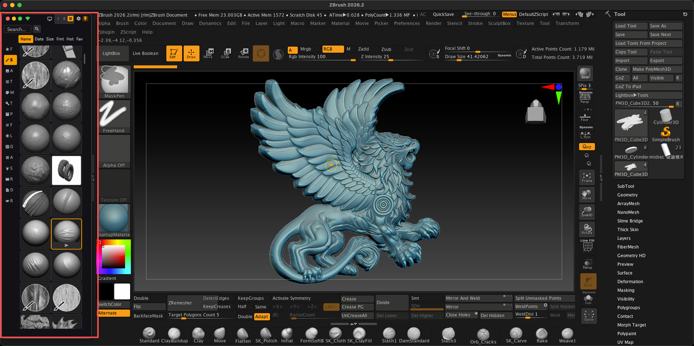
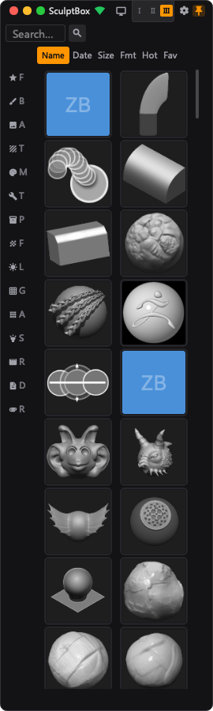
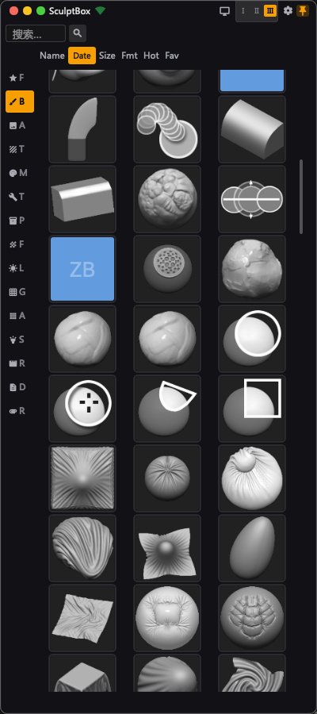

# SculptBox — ZBrush Brush Manager & 3D Asset Manager

**SculptBox is a ZBrush brush manager for macOS and Windows that lets 3D artists organize, search, tag and preview their ZBrush brush library (.ZBP / .ZBR / .MNU) outside of ZBrush — no need to launch ZBrush just to browse.**

**Sculpt Mode** — a compact floating window that sits *beside* ZBrush, so you can browse, search and send brushes without covering your viewport.

**3D Asset Management Tool — Your brush library, at your fingertips.**

Free · 4 languages (English / 中文 / 日本語 / 한국어) · macOS &amp; Windows

---

English · [中文](README.zh.md) · [日本語](README.ja.md) · [한국어](README.ko.md)

---

## Download

| Version | Download | Notes |
|:--------|:---------|:------|
| macOS **V1.6** | [GitHub Releases](https://github.com/skillshen-boop/zbrush-sculptbox/releases/latest) | Direct download · 137 MB |
| macOS **V1.6** | [Baidu Pan](https://pan.baidu.com/s/11POEsG_BtU3o6nINWO0w7g?pwd=42by) | Code: 42by |
| Windows **V1.6** | [Baidu Pan](https://pan.baidu.com/s/11POEsG_BtU3o6nINWO0w7g?pwd=42by) | `.exe` installer · Code: 42by |

> **Free, no account, no trial limit.** SculptBox treats your brush folders as read-only — your `.ZBP` files are never moved, renamed or edited. The only network access is an optional update check, which you can turn off.

---

## First Time Install

macOS may show **"SculptBox is damaged and cannot be opened"**.

This is not a broken file — the app just hasn't been code-signed. Fix it with one command:

```bash
sudo xattr -rd com.apple.quarantine /Applications/SculptBox.app
```

Or go to **System Settings → Privacy & Security**, click **Open Anyway**.

---

## Quick Start

1. Download the DMG, drag SculptBox into Applications
2. If blocked, run the command above
3. Launch SculptBox
4. Go to **Settings → Plugin Status → Install** to set up **Sculpt Bridge**
5. Restart ZBrush

---

## Features

### Sculpt Mode — the window that stays out of the way



A compact floating window that sits **beside** ZBrush instead of on top of it. Three heights, drag to resize, and it remembers where you put it — so your viewport never gets covered mid-sculpt.

 

### Brush Management


SculptBox indexes your entire brush library — brushes, alphas, materials and textures, each in its own category. Thousands of brushes, loaded in seconds.

- **Search** — Type any keyword, results appear instantly


- **Tags** — 10 auto-tags (Sculpting, Curve, Insert, Utility...) + custom tags
- **Favorites** — Star your most-used brushes, access them in one click


- **Filter** — Browse by category or scan directory

### Thumbnail Preview

 

Every brush shows its real thumbnail — no more guessing from file names. Native .ZBP parsing, 50ms per brush. Supports S/M/L three sizes.

### Send to ZBrush


Right-click any brush → **Send to ZBrush**. The brush loads instantly via **Sculpt Bridge**. No more manual file browsing in ZBrush.

### Batch Operations


Select multiple brushes → batch send to ZBrush, batch export thumbnails, batch tag.

### Multi-Language

4 languages built-in: English, Chinese, Japanese, Korean. Switch anytime in Settings.


### Plugin Status & One-Click Deploy


Settings → Plugin Status shows you everything:
- ZBrush installation status
- **Sculpt Bridge** deployment
- Ready-to-send status
- LaunchAgent status

Click **Install** to set up Sculpt Bridge in under a minute. No terminal, no config files.

### Settings & About

 

---

## How to Use

### Adding Your Brush Library

1. Open SculptBox
2. Click the Settings gear icon
3. Go to **Scan Directories** → **Add**
4. Select folders containing your .ZBP / .ZBR / .MNU files
5. Wait for scanning to complete

### Searching Brushes

Type in the search bar at the top. Results filter in real-time. Use tags on the right panel to narrow down by category.

### Sending to ZBrush

1. Make sure ZBrush is running
2. Right-click any brush
3. Click **Send to ZBrush**
4. The brush appears in ZBrush instantly

### Batch Sending

1. Select multiple brushes (hold Shift/Cmd)
2. Right-click → **Send to ZBrush**
3. SculptBox sends them one by one via **Sculpt Bridge**

### Managing Tags

- Auto-tags are generated from file names
- Click tags on the right panel to filter
- Add custom tags via the tag editor
- Tags persist across sessions

---

## Requirements

- macOS 10.15+
- ZBrush 2026+ (for Send to ZBrush feature)
- Python 3.9+ (for development)

---

## Who It's For

SculptBox fits anywhere ZBrush sits in the pipeline:

| Field | Typical users |
|:--|:--|
| **Jewelry & fine jewelry design** | Jewelry designers, jewelry CAD designers, bench jewelers sculpting rings and pendants in ZBrush |
| **Film & VFX** | Character artists, creature designers, modelers on film and episodic VFX |
| **Game art** | Character artists, hard-surface artists, environment and prop modelers |
| **Collectibles, toys & miniatures** | Toy designers, figurine and statue sculptors, miniature makers, 3D printing artists |
| **Concept & illustration** | Concept artists and creature designers who sculpt their concepts |
| **3D printing** | Anyone preparing resin-printable or printable sculpts |

Everyday roles: digital sculptors, 3D artists, digital sculpting students and art-school learners, freelancers and studios working in ZBrush 2026 and later.

## FAQ

**Where are ZBrush brushes stored?**
ZBrush keeps user brushes in its user-content folders (ZStartup / ZBrushData). The exact path varies by version — see Maxon's documentation.

**How do I organize ZBrush brushes when I have thousands?**
Point SculptBox at your brush folders. It indexes every .ZBP / .ZBR / .MNU file, shows real thumbnails, and gives you instant search, tags and favorites.

**How do I find a brush by name instead of scrolling LightBox?**
Search in SculptBox, then send it straight into ZBrush — no manual LightBox browsing.

**Does it work with insert mesh (IMM) brushes, alphas and matcaps?**
Yes. SculptBox indexes IMM / insert-mesh brushes, alphas, matcaps, and regular brushes.

**My brushes disappeared after a ZBrush update. Why?**
Recent ZBrush releases changed the user asset directory layout. SculptBox scans whatever folders you point it at, so it can catalog brushes that ZBrush's own browser no longer shows.

**Does SculptBox work without ZBrush installed?**
Yes. Thumbnails are parsed natively from the .ZBP files, so ZBrush does not need to be running — or even installed — to browse your library.

## Links

- Website: [sculptbox.net](https://sculptbox.net)
- Download: [GitHub Releases](https://github.com/skillshen-boop/zbrush-sculptbox/releases)
- Feedback: [Issues](https://github.com/skillshen-boop/zbrush-sculptbox/issues)

---

*SculptBox — 3D Asset Management Tool*
