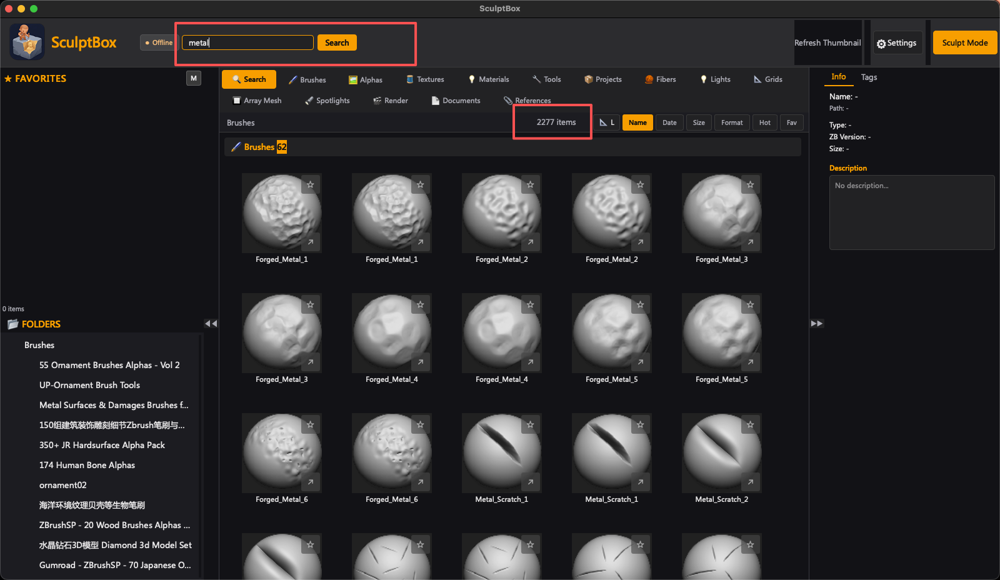
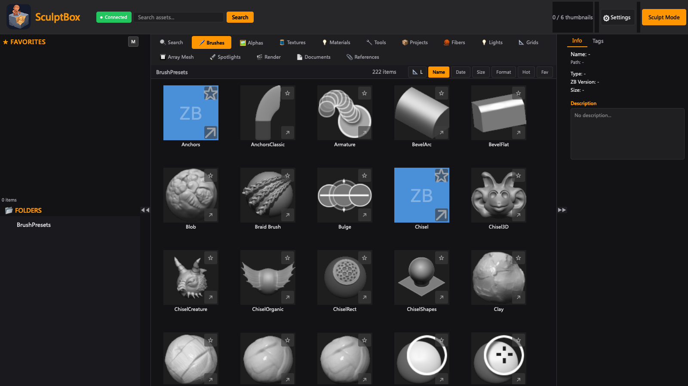

# SculptBox — ZBrush 笔刷管理 & 3D 资产管理工具

**SculptBox 是一款面向 macOS 与 Windows 的 ZBrush 笔刷管理工具，让 3D 艺术家无需打开 ZBrush 就能整理、搜索、打标签和预览自己的笔刷库（.ZBP / .ZBR / .MNU）。**

**3D 资产管理工具 — 让笔刷库随取随用。**

---

[English](README.md) · 中文 · [日本語](README.ja.md) · [한국어](README.ko.md)

---

## 📥 下载

| 版本 | 下载 | 说明 |
|:----|:----|:------|
| macOS V1.1 | [⬇️ GitHub Releases](https://github.com/skillshen-boop/zbrush-sculptbox/releases/latest) | 直接下载 |
| macOS V1.1 | [☁️ 百度网盘](https://pan.baidu.com/s/1BeFZfMoCmqbfOQDEYJQdSg?pwd=tayr) | 提取码: tayr |

---

## ⚠️ 首次安装

macOS 可能提示 **"SculptBox 已损坏，无法打开"**。不是文件坏了，执行：

```bash
sudo xattr -rd com.apple.quarantine /Applications/SculptBox.app
```

或 **系统设置 → 隐私与安全性 → 仍然打开**。

---

## 🚀 快速开始

1. 下载 DMG，拖入 Applications
2. 如果报错，执行上面的命令
3. 启动 SculptBox
4. Settings → Plugin Status → Install 一键部署桥接
5. 重启 ZBrush

---

## ✨ 功能介绍

### 笔刷管理


SculptBox 自动索引你的全部笔刷目录。几千个笔刷，几秒加载完成。

- **搜索** — 输入关键词，实时过滤



- **标签** — 10 个自动标签（雕刻/曲线/插入/工具...）+ 自定义标签
- **收藏夹** — 星标收藏，一键切换


- **分类** — 按目录浏览，按类型筛选

### 缩略图预览

 

每个笔刷实时显示真实缩略图，不用再靠文件名猜。原生 ZBP 解析，50ms 一个。支持 S/M/L 三级缩放。

### Send to ZBrush


任意笔刷上右键 → Send to ZBrush，通过 IPC 桥接实时加载。不用再在 ZBrush 里翻文件夹了。

### 批量操作


多选笔刷 → 批量发送到 ZBrush、批量导出缩略图、批量打标签。

### 多语言

内置 4 种语言：中文、English、日本語、한국어，在 Settings 随时切换。


### 桥接状态一键查看


Settings → Plugin Status 一目了然：
- ZBrush 是否安装
- 桥接脚本是否部署
- IPC 目录是否就绪
- LaunchAgent 状态

点击 **Install**，1 分钟完成部署，不需要终端。

### Settings 与 About

 

---

## 📖 使用说明

### 添加笔刷目录

1. 打开 SculptBox
2. 点击右上角齿轮图标设置
3. 进入 **扫描目录** → **添加**
4. 选择放笔刷的文件夹（.ZBP / .ZBR / .MNU）
5. 等待扫描完成

### 搜索笔刷

在顶栏搜索框输入关键词，结果实时过滤。右侧标签面板按分类筛选。

### 发送到 ZBrush

1. 确保 ZBrush 正在运行
2. 右键点击任意笔刷
3. 选择 **Send to ZBrush**
4. 笔刷自动出现在 ZBrush 中

### 批量发送

1. 按住 Shift/Cmd 多选笔刷
2. 右键 → Send to ZBrush
3. SculptBox 通过 IPC 桥接逐个发送

### 管理标签

- 自动标签从文件名检测生成
- 点击标签按分类筛选
- 支持自定义标签，跨会话持久化

---

## 系统要求

- macOS 10.15+
- ZBrush 2026+（Send to ZBrush 功能需要）
- Python 3.9+（开发用）

---

## 适用人群与行业

只要 ZBrush 在流程里，SculptBox 就能派上用场：

| 领域 | 典型使用者 |
|:--|:--|
| **珠宝 / 首饰设计** | 珠宝设计师、珠宝 CAD 设计师、用 ZBrush 雕戒指与吊坠的打版师 |
| **电影 / VFX** | 角色美术、生物设计、影视模型师 |
| **游戏美术** | 角色美术、硬表面美术、场景与道具模型师 |
| **手办 / 潮玩 / 微缩** | 玩具设计师、手办与雕像雕刻师、微缩模型师、3D 打印建模师 |
| **概念设计** | 用雕刻方式做设计的原画师与生物设计师 |
| **3D 打印** | 需要准备可打印模型的创作者 |

日常角色：数字雕刻师、3D 建模师、雕刻专业学生与美术院校学习者、自由职业者与工作室（ZBrush 2026 及以上）。

## 常见问题

**ZBrush 笔刷存在哪里？**
存在 ZBrush 的用户内容目录（ZStartup / ZBrushData）中，具体路径随版本不同，可参考 Maxon 官方文档。

**笔刷太多怎么整理？**
把 SculptBox 指向你的笔刷目录。它会索引全部 .ZBP / .ZBR / .MNU 文件，显示真实缩略图，并提供即时搜索、标签与收藏。

**怎么按名字找笔刷，而不是在 LightBox 里翻？**
在 SculptBox 里搜索，然后直接发送进 ZBrush，不用再手动翻 LightBox。

**支持插入笔刷（IMM）、Alpha 和 Matcap 吗？**
支持。SculptBox 会索引 IMM / 插入网格笔刷、Alpha、Matcap 和普通笔刷。

**ZBrush 升级后笔刷不见了，为什么？**
较新的 ZBrush 版本改动了用户资产目录结构。SculptBox 扫描的是你指定的目录，因此能把 ZBrush 自身浏览器里已经看不到的笔刷重新编目出来。

**没装 ZBrush 能用吗？**
可以。缩略图是从 .ZBP 文件原生解析的，浏览笔刷库不需要 ZBrush 运行，也不需要安装。

## 🔗 链接

- 官网：[sculptbox.net](https://sculptbox.net)
- 下载：[GitHub Releases](https://github.com/skillshen-boop/zbrush-sculptbox/releases)
- 反馈：[Issues](https://github.com/skillshen-boop/zbrush-sculptbox/issues)

---

*SculptBox — 3D 资产管理工具*
